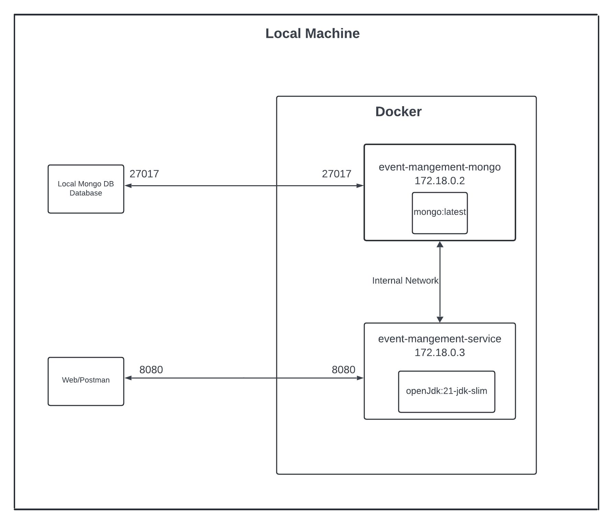

# Event Management Service

## System Architecture



## How To Run
1. Clone the repository
2. Open maven project in IDE
3. Open terminal and Run ```mvn clean package``` to build the project (This will create .jar file in your `target` folder)
4. Open terminal and run ```docker-compose up --build``` command to run the project
5. Open Postman and import the collection from `EventManagementService.postman_collection.json` file
6. Run the collection
7. You can see the logs in the terminal
8. To stop the project run ```docker-compose down``` command
